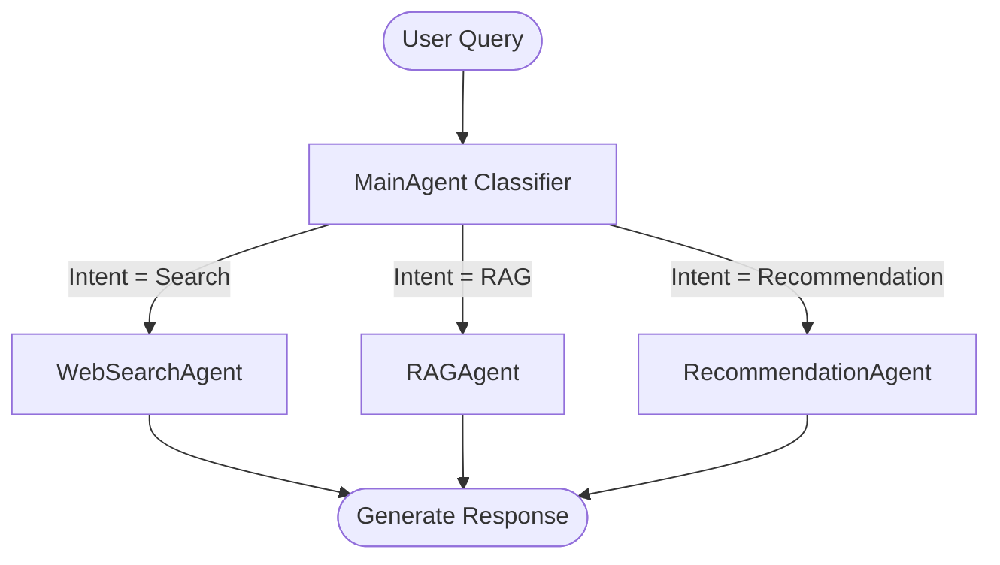

# CoFoundr Technical Architecture

This document describes the architectural specifications, multi-agent orchestrations, database patterns, and security frameworks of the CoFoundr application.

---

## 1. System Topology

```
                  [User Browser / Next.js]
                             │
            ┌────────────────┴────────────────┐
            │ JWT Auth / WebSockets / REST    │
            ▼                                 ▼
   [FastAPI Gateway] ──► [Startup Service] ──► [LangGraph Engine]
            │                     │                   │
            ▼                     ▼                   ▼
    [PostgreSQL 15]        [Supabase / S3]     [Gemini & Groq]
   (User, Chat, Reports)   (Static PDFs)       (LLM Providers)
```

---

## 2. Multi-Agent Orchestrator Graph

The orchestrator utilizes **LangGraph** to model multi-agent workflows as state-machine transition systems.

### Agent States
The state is managed in the `AgentState` schema containing:
- `messages`: Chronological conversation logs list.
- `startup_id`: Current active context startup identifier.
- `next_agent`: Targeted routing index string.
- `response`: Text summary of the latest step execution.
- `metadata`: General key-value logs storing computed scoring payloads.

### Graph Flow Diagram


1. **MainAgent Classifier:** Evaluates the user query to categorize the intent (General Search, Context RAG, or Recommendation Audit).
2. **WebSearchAgent:** Invokes the Tavily search tool to pull live competitive and market-size metrics.
3. **RAGAgent:** Queries ChromaDB collections utilizing Cosine similarity vector matching over uploaded company files.
4. **RecommendationAgent:** Triggers internal rules-based calculation engines and prompts Gemini Flash to synthesize YC-partner reviews.

---

## 3. Database Schema ERD

```
  ┌──────────────┐          ┌──────────────┐          ┌─────────────────┐
  │     User     │1       * │   Startup    │1       * │  Report / Logs  │
  ├──────────────┤ ───────► ├──────────────┤ ───────► ├─────────────────┤
  │ id (UUID)    │          │ id (UUID)    │          │ id (UUID)       │
  │ email        │          │ user_id      │          │ startup_id      │
  │ name         │          │ name         │          │ report_type     │
  │ password_hash│          │ health_score │          │ content         │
  └──────────────┘          └──────────────┘          └─────────────────┘
         │ 1
         │
         ▼ *
  ┌──────────────┐1       * ┌─────────────────┐
  │ Chat Session │ ───────► │  Chat Message   │
  ├──────────────┤          ├─────────────────┤
  │ id (UUID)    │          │ id (UUID)       │
  │ user_id      │          │ chat_session_id │
  │ title        │          │ role            │
  └──────────────┘          │ content         │
                            └─────────────────┘
```

- **User:** Store user credential profiles.
- **Startup:** Keeps founder responses and the cached health score index.
- **Chat Session / Message:** Chronological thread transcripts.
- **Report Logs:** Strategic advisory audits saved in Markdown formats.

---

## 4. Real-Time WebSocket Architecture

1. **Handshake Verification:** Client establishes WebSocket connection to `/api/v1/dashboard/ws?token=<JWT>`. The router decodes and asserts token signatures.
2. **Registry:** Active connections are mapped by user IDs in the `ConnectionManager` class.
3. **Trigger Updates:** When background tasks (like YC assessments or document indexers) complete, services call:
   `await connection_manager.send_dashboard_update(user_id_str, updated_metrics_payload)`.

---

## 5. Security & Authentication Designs

- **OAuth 2.0 Integration:** Google and GitHub authentication redirections are parsed and verified using client redirect callbacks. Unregistered profiles are created dynamically.
- **JWT Session Tokens:** JWT strings are signed using secret keys with `HS256` hashing. Decoded user IDs are injected as dependencies.
- **Password Hashes:** Hashed using `bcrypt` to prevent plaintext exposures.
