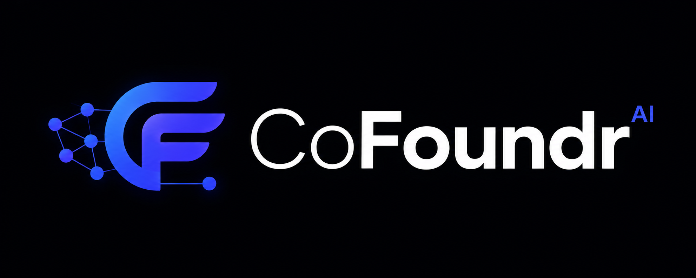
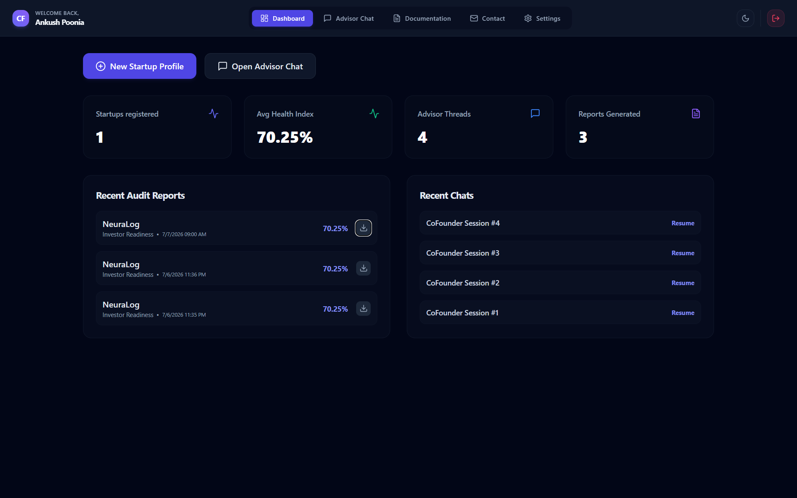
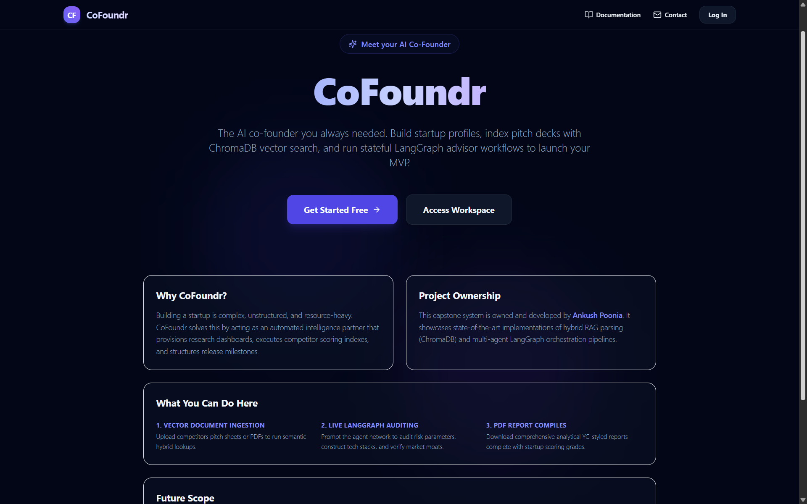
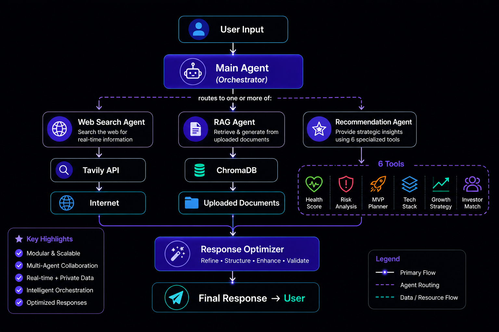
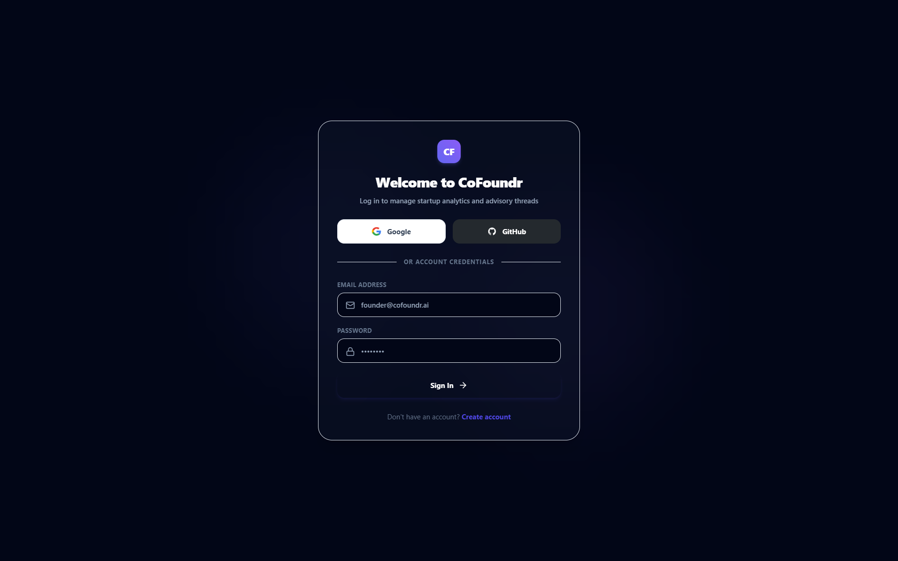
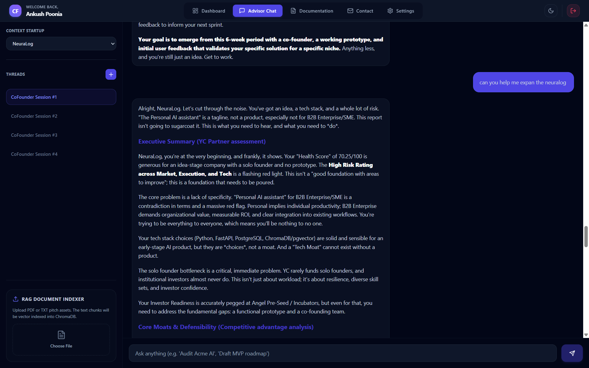
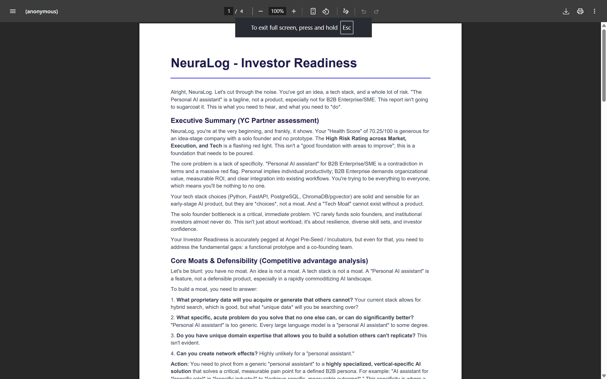

<div align="center">



# CoFoundr

*The AI co-founder you always needed.*

[](https://www.python.org/)
[](https://fastapi.tiangolo.com/)
[](https://nextjs.org/)
[](https://github.com/langchain-ai/langgraph)
[](https://www.docker.com/)
[](LICENSE)

<br/>

> **CoFoundr** is a production-grade, multi-agent AI system that acts as your on-demand Y Combinator advisor.
> It researches your market, analyzes your startup, scores your investor readiness,
> and recommends your next move — all in one conversation.

<br/>

[🚀 Get Started](#-getting-started) · [📖 Documentation](DOCUMENTATION.md) · [🏗️ Architecture](ARCHITECTURE.md) · [🐛 Report Bug](https://github.com/ankush-poonia007/cofoundr/issues) · [✨ Request Feature](https://github.com/ankush-poonia007/cofoundr/issues)

</div>

---

<div align="center">

## 📷 Live Dashboard Preview



*CoFoundr Dashboard — Startup health score, competitor analysis, and active advisor sessions.*

</div>

---

## 🗺️ Table of Contents

- [ℹ️ About The Project](#ℹ️-about-the-project)
- [🤖 Multi-Agent Architecture](#-multi-agent-architecture)
- [🛠️ Tech Stack](#️-tech-stack)
- [🚀 Getting Started](#-getting-started)
- [💡 Usage](#-usage)
- [🔌 API Documentation](#-api-documentation)
- [📁 Project Structure](#-project-structure)
- [🔒 Environment Variables](#-environment-variables)
- [🗺️ Roadmap](#️-roadmap)
- [🤝 Contributing](#-contributing)
- [📄 License](#-license)
- [🙏 Acknowledgements](#-acknowledgements)
- [📬 Contact](#-contact)

---

## ℹ️ About The Project

CoFoundr is a production-grade AI-powered startup research, analysis, and strategic advisory agent designed to act as an automated Y Combinator Managing Partner.

### The Problem It Solves

Over 90% of early-stage startups fail due to lack of market validation, poor architectural choices, or running out of runway. Access to seasoned venture advisors is scarce and expensive.

**CoFoundr bridges this gap** — acting as an on-demand, institutional-grade AI co-founder. It analyzes venture profiles, evaluates operational risks, recommends scalable tech stacks, maps MVP timelines, and highlights fundraising barriers.

<br/>

### ✨ Key Features

| Feature | Description |
|---------|-------------|
| 🤖 **LangGraph Orchestrator** | Dynamic intent classification and stateful routing across specialized agents |
| 📈 **Deterministic Scoring** | Standardized algorithms evaluating venture health, execution risk, and investor readiness |
| 📂 **Grounded Vector RAG** | Semantic indexing of pitch decks and business plans via ChromaDB |
| 📄 **PDF Report Generation** | On-demand styled advisory reports compiled with ReportLab |
| 🔐 **Production Security** | JWT sessions, IP-based rate limiting, and file upload sanitization |
| 🔑 **OAuth Authentication** | Passwordless Google + GitHub OAuth with account linking |
| 🔌 **Realtime WebSocket** | Live dashboard updates pushed directly to the frontend |

<br/>

<div align="center">


*CoFoundr Marketing Landing Page — introducing the automated YC advisor.*
</div>

---

## 🤖 Multi-Agent Architecture

CoFoundr manages user messages using a state-machine router built on LangGraph. The orchestrator classifies intent and routes to specialized agents in parallel or sequence.

```
                  ┌──────────────────────┐
                  │   User Message /     │
                  │   Strategic Query    │
                  └──────────┬───────────┘
                             │
                             ▼
                  ┌──────────────────────┐
                  │  MainAgent Router    │
                  │  (Intent Classifier) │
                  └──────────┬───────────┘
                             │
            ┌────────────────┼────────────────┐
            │ (web_search)   │ (rag)          │ (recommendation)
            ▼                ▼                ▼
      ┌───────────┐    ┌───────────┐    ┌───────────┐
      │ WebSearch │    │ RAGAgent  │    │   Recs    │
      │   Agent   │    │ (Chroma)  │    │   Agent   │
      └─────┬─────┘    └─────┬─────┘    └─────┬─────┘
            │                │                │
            └────────────────┼────────────────┘
                             │
                             ▼
                      ┌─────────────┐
                      │  Response   │
                      │  Optimizer  │
                      └──────┬──────┘
                             │
                             ▼
                      ┌─────────────┐
                      │    User     │
                      └─────────────┘
```

<br/>

<div align="center">


*LangGraph execution trace — routing nodes and unified agent response compilation.*
</div>

<br/>

| Agent | Role | LLM | Tools |
|-------|------|-----|-------|
| **MainAgent** | Intent classification and routing | Groq Llama 3 | Router, Classifier |
| **WebSearchAgent** | Live market and competitor research | Groq Llama 3 | Tavily Search x4 |
| **RAGAgent** | Document grounding and retrieval | Gemini Flash | ChromaDB, Gemini Embeddings |
| **RecommendationAgent** | Strategic analysis and scoring | Gemini Flash | 6 Scoring Tools |

---

## 🛠️ Tech Stack

<div align="center">

### Backend

| Layer | Technology | Purpose |
|-------|-----------|---------|
| **API Framework** | FastAPI 0.111 | High-speed async ASGI web framework |
| **Orchestration** | LangGraph 0.1 | Stateful multi-agent graph routing |
| **Reasoning LLM** | Gemini 2.5 Flash | Complex reasoning and advisory generation |
| **Routing LLM** | Groq Llama 3 | Fast intent classification and tool calling |
| **Embeddings** | Gemini text-embedding-004 | Semantic document representation |
| **Vector Store** | ChromaDB | Local vector store with hybrid search |
| **Relational DB** | PostgreSQL 15 | Users, sessions, and report storage |
| **ORM** | SQLAlchemy 2.0 | Async connection pool and model mapping |
| **Migrations** | Alembic | Declarative schema version control |
| **PDF Engine** | ReportLab | In-memory styled PDF compilation |
| **Web Search** | Tavily API | Live market intelligence grounding |

### Frontend

| Layer | Technology | Purpose |
|-------|-----------|---------|
| **Framework** | Next.js 14 (App Router) | Server component routing and SSR |
| **Language** | TypeScript | Type-safe component development |
| **Styling** | TailwindCSS | Utility-first responsive design |
| **State** | Zustand | Lightweight reactive store slices |
| **Data Fetching** | TanStack Query | Server state caching and sync |
| **Realtime** | WebSockets | Live dashboard metric streaming |
| **Auth** | NextAuth.js | OAuth session management |

### Infrastructure

| Layer | Technology |
|-------|-----------|
| **Containerization** | Docker + Docker Compose |
| **Deployment** | Railway |
| **File Storage** | Supabase |
| **Runtime** | Python 3.11 + Node.js 20 |

</div>

---

## 🚀 Getting Started

### Prerequisites

- [Docker Desktop](https://www.docker.com/products/docker-desktop/) installed
- API Keys from: [Google AI Studio](https://aistudio.google.com/), [Groq](https://console.groq.com/), [Tavily](https://app.tavily.com/)
- Python 3.11+ (for local development only)
- Node.js 20+ (for local development only)

### Installation

**1. Clone the repository**
```bash
git clone https://github.com/ankush-poonia007/CoFoundr.git
cd cofoundr
```

**2. Setup environment variables**
```bash
cp backend/.env.example backend/.env
cp frontend/.env.example frontend/.env.local
```

**3. Fill in your API keys in `backend/.env`**

See the [Environment Variables](#-environment-variables) section below for all required keys.

### Running with Docker (Recommended)

```bash
# Start all 4 services: PostgreSQL, ChromaDB, FastAPI, Next.js
docker compose up --build
```

| Service | URL |
|---------|-----|
| 🌐 Frontend | http://localhost:3000 |
| ⚡ Backend API | http://localhost:8000 |
| 📖 API Docs | http://localhost:8000/api/docs |

### Running Locally

**Backend**
```bash
cd backend
python -m venv .venv
source .venv/bin/activate  # Windows: .venv\Scripts\activate
pip install -r requirements.txt
uvicorn main:app --reload
```

**Frontend**
```bash
cd frontend
npm install
npm run dev
```

---

## 💡 Usage

<div align="center">

### Step 1 — Onboarding



*Multi-phase startup profile registration — name, stage, UVP, business model, target market.*

</div>

<br/>

<div align="center">

### Step 2 — Strategic Advisory Chat



*AI advisor chat grounded with your uploaded documents via RAG.*

</div>

<br/>

<div align="center">

### Step 3 — Generate Reports



*7 report types generated on-demand and downloadable as styled PDF documents.*

</div>

---

## 🔌 API Documentation

All routes are prefixed with `/api/v1`. Full interactive docs at `http://localhost:8000/api/docs`.

| Method | Endpoint | Description | Auth |
|--------|----------|-------------|------|
| `POST` | `/auth/register` | Register with email/password | Public |
| `POST` | `/auth/login` | Login and receive JWT | Public |
| `GET` | `/auth/google` | Google OAuth redirect | Public |
| `GET` | `/auth/github` | GitHub OAuth redirect | Public |
| `GET` | `/auth/me` | Get current user details | JWT |
| `GET` | `/startups` | List user startups | JWT |
| `POST` | `/startups` | Register new startup profile | JWT |
| `POST` | `/startups/{id}/analyze` | Trigger full YC scoring audit | JWT |
| `POST` | `/startups/{id}/documents` | Upload and vector-index document | JWT |
| `POST` | `/chats/{id}/messages` | Send message, run LangGraph | JWT |
| `GET` | `/reports/{id}/download` | Stream PDF report bytes | JWT |
| `GET` | `/dashboard` | Fetch aggregated analytics | JWT |
| `WS` | `/dashboard/ws` | Realtime WebSocket connection | JWT Query |

---

## 📁 Project Structure

```
cofoundr/
├── backend/
│   ├── app/
│   │   ├── agents/          # LangGraph orchestrator nodes & AgentState
│   │   ├── api/v1/          # FastAPI routers & endpoint handlers
│   │   ├── core/            # Config, constants, logging & security
│   │   ├── db/              # SQLAlchemy sessions & base model definitions
│   │   ├── middleware/       # CORS, Auth, RateLimiter, ErrorHandler
│   │   ├── models/          # Declarative ORM models (User, Startup, Report)
│   │   ├── providers/       # LLM provider adapters (Gemini & Groq)
│   │   ├── repositories/    # Database transaction repositories
│   │   ├── schemas/         # Pydantic request/response schemas
│   │   ├── services/        # Business logic (Startup, Chat, Report, Dashboard)
│   │   ├── tools/           # Scoring calculators, vector search, file parsers
│   │   └── websockets/      # WebSocket ConnectionManager
│   ├── alembic/             # Database migration scripts
│   ├── scripts/             # Utility scripts (check_env.py)
│   ├── tests/               # Pytest suite (API, services, tools)
│   └── requirements.txt
├── frontend/
│   ├── src/
│   │   ├── app/             # Next.js App Router pages
│   │   ├── components/      # Shared React components
│   │   ├── lib/             # Axios client + auth config
│   │   ├── providers/       # Auth, Theme, Query contexts
│   │   └── store/           # Zustand state slices
│   └── package.json
├── assets/
│   └── screenshots/         # README images
├── docker-compose.yml
├── ARCHITECTURE.md
├── DOCUMENTATION.md
├── CHANGELOG.md
└── LEARNING_LOG.md
```

---

## 🔒 Environment Variables

Copy `backend/.env.example` to `backend/.env` and fill in all required values.

| Variable | Description | Required |
|----------|-------------|----------|
| `DATABASE_URL` | PostgreSQL connection string | ✅ |
| `CHROMA_HOST` | ChromaDB hostname | ✅ |
| `CHROMA_PORT` | ChromaDB port | ✅ |
| `GEMINI_API_KEY` | Google AI Studio API key | ✅ |
| `GROQ_API_KEY` | Groq Console API key | ✅ |
| `TAVILY_API_KEY` | Tavily Search API key | ✅ |
| `JWT_SECRET_KEY` | JWT signing secret (32+ chars) | ✅ |
| `GOOGLE_CLIENT_ID` | Google OAuth Client ID | ✅ |
| `GOOGLE_CLIENT_SECRET` | Google OAuth Client Secret | ✅ |
| `GITHUB_CLIENT_ID` | GitHub OAuth Client ID | ✅ |
| `GITHUB_CLIENT_SECRET` | GitHub OAuth Client Secret | ✅ |
| `SUPABASE_URL` | Supabase project URL | ⚙️ Optional |
| `SUPABASE_KEY` | Supabase anon key | ⚙️ Optional |

> 💡 Run `python scripts/check_env.py` to validate all variables are set before startup.

---

## 🗺️ Roadmap

### v1.0.0 — Current ✅
- Multi-agent LangGraph orchestration (search / RAG / scoring)
- ChromaDB vector indexing with Gemini embeddings
- 6 scoring tools: health, risk, MVP, tech stack, growth, investor readiness
- Google + GitHub OAuth with JWT sessions
- Realtime WebSocket dashboard
- 7 report types with PDF export

### v1.1.0 — Planned 🔜
- Streaming token responses in advisor chat
- Persistent ChromaDB database-backed storage
- Financial runway projection charts

### v2.0.0 — Future Vision 🔮
- AI-to-AI pitch deck review simulations
- Multi-user team collaboration workspaces
- Global venture comparison dashboard across industries

---

## 🤝 Contributing

Contributions are welcome! Please follow these steps:

1. Fork the repository
2. Create your feature branch:
   ```bash
   git checkout -b feat/your-feature-name
   ```
3. Commit using Conventional Commits:
   ```bash
   git commit -m "feat(agents): add memory persistence to RAG agent"
   ```
4. Push and open a Pull Request against `main`

**Commit types:** `feat` · `fix` · `docs` · `chore` · `test` · `refactor`

---

## 📄 License

This project is licensed under the **MIT License** — you are free to use, modify, and distribute this software with proper attribution.

See the [LICENSE](LICENSE) file for full terms.

---

## 🙏 Acknowledgements

- [LangChain](https://www.langchain.com/) + [LangGraph](https://github.com/langchain-ai/langgraph) — multi-agent state machine framework
- [Google AI Studio](https://aistudio.google.com/) — Gemini Flash reasoning and embeddings
- [Groq](https://groq.com/) — ultra low-latency LLM inference
- [Tavily](https://tavily.com/) — real-time web search grounding
- [ChromaDB](https://www.trychroma.com/) — local vector store
- [FastAPI](https://fastapi.tiangolo.com/) — modern Python API framework
- [Next.js](https://nextjs.org/) — React production framework

---

## 📬 Contact

<div align="center">

Built with 🤍 by **Ankush Poonia**

<br/>

[](https://github.com/ankush-poonia007)
[](https://www.linkedin.com/in/ankush-poonia007/)
[](mailto:pooniaankush007@gmail.com)

<br/>

**Project:** [https://github.com/ankush-poonia007/CoFoundr](https://github.com/ankush-poonia007/CoFoundr)

<br/>

*If CoFoundr helped you, consider giving it a ⭐ on GitHub!*

</div>

---

<div align="center">

*CoFoundr v1.0.0 — The AI co-founder you always needed.*

</div>